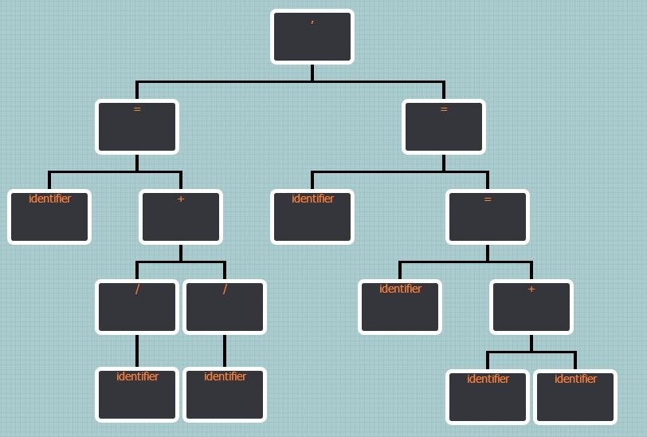

# My_Compiler

This is some simple project (VS 2013) when I am learning the compiler principles.

All the grammers are follow the C language.

## Module_lex 

The lex module, input the source code and ouput the tokens.

For example, you the code you input:
```
char str[256];
int a=0,b=0,c=0;
int main()
{
	gets(str);
	for(;str[a]!='\0';a++)
	{
		if(str[a]==' ')
		{
			c=0;
		}
	}
	printf("%d",b);
	return 0;
}
```
the output will be:
```
char identifier[integer constant];
int identifier=integer constant,identifier=integer constant,identifier=integer constant;
int identifier()
{
        identifier(identifier);
        for(;identifier[identifier]!=string constant;identifier++)
        {
                if(identifier[identifier]==string constant)
                {
                        identifier=integer constant;
                }
                else if(identifier==integer constant)
                {
                        identifier=integer constant;
                        identifier++;
                }
        }
        identifier(string constant,identifier);
        return integer constant;
}
```

## Module_declare

the declation module to analysis the variable declare and record the information of variable.

also there have some syntax check in the program.

For example you input the source code:
```
int xx;
int x;
short y;

int a(int a, int b)
{
	int c; 
	int d;
    int a;
};
```

the result of analysis will be:
```
DBG_Decl_Information： Name: xx hash:17760
        scope:0 type:int        size:

DBG_Decl_Information： Name: x  hash:120
        scope:0 type:int        size:

DBG_Decl_Information： Name: y  hash:121
        scope:0 type:int        size:short

DBG_Decl_Information： Name: a  hash:97
        scope:0 type:int        size:

DBG_Decl_Information： Name: a  hash:97
        scope:1 type:int        size:

DBG_Decl_Information： Name: b  hash:98
        scope:1 type:int        size:

DBG_Decl_Information： Name: c  hash:99
        scope:1 type:int        size:

DBG_Decl_Information： Name: d  hash:100
        scope:1 type:int        size:

ERROR in line:9   Redeclaration
```

## Module_expr  -- undone

Analysis the expression and output the syntax tree with the [jOrgChart](https://github.com/wesnolte/jOrgChart)

The input is a expression like this:
```
a = b = a+b, c = 1/a+3/b;
```
The output tree is:
